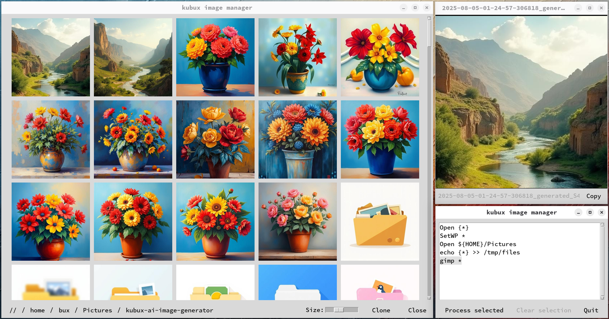

# README.md for Kubux Image Manager



## Overview

Kubux Image Manager is a powerful yet simple Tkinter-based image management application for Linux desktop environments. It provides an intuitive interface for browsing, viewing, organizing, and manipulating image files with support for batch operations through customizable commands.

## Features

- **Flexible Image Browsing**: Navigate your file system with an intuitive breadcrumb interface
- **Thumbnail Gallery**: View image thumbnails with adjustable size
- **Advanced Image Viewer**: Built-in viewer with zoom, pan, and fullscreen capabilities
- **Multi-Selection Operations**: Select multiple files for batch operations
- **Drag and Drop File Management**: Move files between directories with intuitive mouse operations
- **Command System**: Execute custom commands on selected files with support for wildcards and environment variables
- **Multi-window Interface**: Open multiple browser windows simultaneously for different folders
- **Persistent Settings**: Application remembers window positions, open directories, and selected files
- **Desktop Integration**: Set wallpaper directly from the application (on supported Linux Desktop Environments)

## Installation

### From Source (Nix)

Kubux Image Manager includes a `flake.nix` for easy installation on NixOS and other systems with Nix package manager:

```bash
nix profile install github:k-u-bux/kubux-image-manager
```

Alternatively, you can test drive the app:

```bash
nix run github:k-u-bux/kubux-image-manager
```

## Usage

### Basic Navigation

- **Browse Images**: Use the breadcrumb navigation to move between directories
- **View Images**: Right-click on a thumbnail to open it in the viewer
- **Select Images**: Left-click on thumbnails to toggle selection for batch operations
- **Clear Selection**: Use the "Clear selection" button to deselect all images

### Mouse Operations

Kubux Image Manager has a dual-button approach for file operations:

#### Left Mouse Button (Selection Operations)
- **Left-click**: Toggle selection status of the clicked file
- **Left-drag**: Drag all currently selected files
- **Left-drop**: Move all selected files to the target directory

#### Right Mouse Button (Single File Operations)
- **Right-click**: Execute the current command on just that specific file
- **Right-drag**: Drag only that specific file (regardless of selection status)
- **Right-drop**: Move only that specific file to the target directory

### Commands

The application uses a command system to operate on selected files. Commands are entered in the text field at the top of the main window.

#### Wildcards

- `*` - Expands to all selected files as separate arguments
- `{*}` - Creates a separate command for each selected file

#### Built-in Commands

- `Open: {path}` - Open a file or directory
- `Fullscreen: {path}` - Open a file in fullscreen mode
- `SetWP: {path}` - Set the specified image as wallpaper
- `Select: {command}` - Run command and select all files in its output
- `Deselect: {command}` - Run command and deselect all files in its output

#### Examples

```
# Open all selected files in the viewer
Open: *

# Move selected files to trash
gio trash *

# Copy selected files to a directory
cp * ~/Pictures/Saved/

# Process each file individually
convert {*} -resize 800x600 ~/Pictures/Resized/$(basename {*})

# Open a specific directory
Open: ${HOME}/Pictures

# Select all JPG files modified in the last week
Select: find . -name "*.jpg" -mtime -7

# Deselect all files larger than 5MB
Deselect: find . -size +5M
```

### Keyboard Shortcuts

#### Main Window
- **Enter**: Execute the current command
- **Escape**: Close a dialog or window

#### Image Browser
- **Up/Down**: Scroll the thumbnail grid
- **Page Up/Down**: Scroll the thumbnail grid by pages
- **Escape**: Close the browser window

#### Image Viewer
- **+/=**: Zoom in
- **-/_**: Zoom out
- **0**: Reset zoom to fit window
- **F11**: Toggle fullscreen
- **Escape**: Close viewer
- **Mouse wheel**: Zoom in/out
- **Mouse drag**: Pan when zoomed

## Configuration

The application stores configuration in:
- `~/.config/kubux-image-manager/app_settings.json`
- `~/.cache/kubux-thumbnail-cache/` for thumbnail cache

## License

Licensed under the Apache License, Version 2.0. See LICENSE file for details.

## Author

Copyright 2025 Kai-Uwe Bux

## Tips

1. **File Selection**: Use the new `Select:` command with `find` for powerful file selection based on attributes like modification time, size, or name patterns.
2. **File Movement**: Right-drag individual files for quick one-off moves without disturbing your current selection.
3. **Batch Processing**: Create custom commands for common operations like resizing, converting, or uploading.
4. **Multiple Browsers**: Use the "Clone" button to open multiple browser windows for side-by-side file management.
5. **Thumbnail Size**: Adjust the thumbnail size slider for better visibility of your images.
6. **Command History**: Commands are saved between sessions for easy reuse.
7. **Quick Navigation**: Long-press on any breadcrumb segment to reveal a directory selection menu.
8. **UI Scaling**: Use the UI scale slider to adjust the interface size based on your screen resolution.
